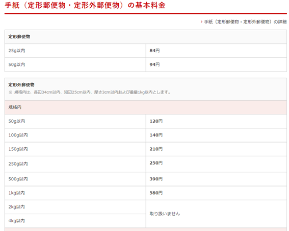

# 事務関連マニュアル
## 休日出勤について
前日の昼までに上長と相談の上、社長へ個別に申請します。

**休日出勤時のタイムカードの打刻漏れ**には特に注意してください。最悪みとめられ
ないケースも発生するので、慎重に対応お願いします。
## 経費の精算について
主な適用項目は次の通りです。
1. 資料代
1. 通信費
1. 消耗品費

|摘要|内容
|--|--
|資料代|書籍 有料アプリ
|通信費|切手 宅配郵便料
|消耗品費|文具 台所用品

## 宅配便の発送について
## 電話、来客対応について
## ゴミ収集について
## プリンタについて
## 大容量データの送受信について
